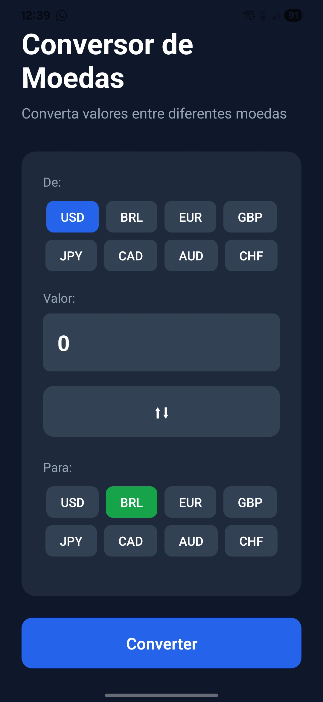
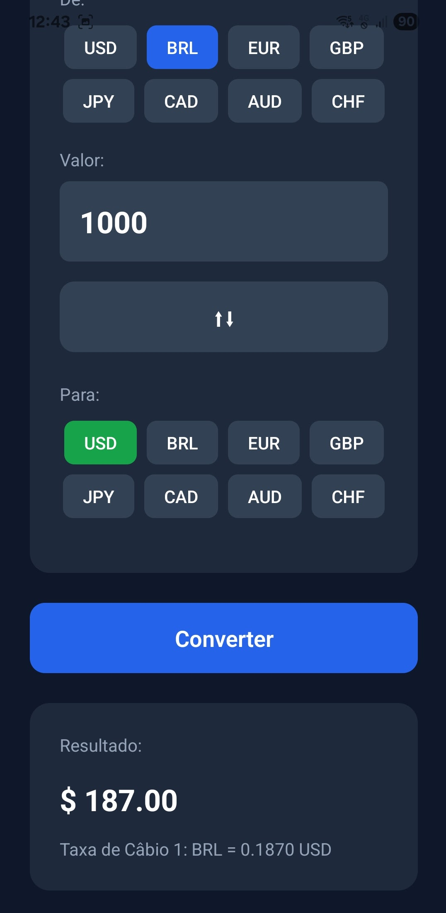

# Conversor de Moedas 💱

Aplicativo desenvolvido com **React Native** e **Expo** para conversão de moedas de forma prática e rápida.  
Projeto criado como prática de estudo em desenvolvimento mobile multiplataforma.

## 📱 Tecnologias utilizadas
- [Expo](https://expo.dev/) ~54.0.10  
- [React](https://react.dev/) 19.1.0  
- [React Native](https://reactnative.dev/) 0.81.4  
- [Expo Status Bar](https://docs.expo.dev/versions/latest/sdk/status-bar/) ~3.0.8  

## 🚀 Como executar
1. Clone este repositório:
   ```bash
   git clone https://github.com/Kevinlps/conversor-app.git

2. Acesse a pasta do projeto:
     cd conversor-app
3. Instale as dependências:
    npm install
4. Inicie o app:
    npm start
    ou
    npm expo start
📖 Créditos

## 📸 Screenshots

### Tela inicial


### Conversão de moedas



## Este projeto foi desenvolvido com base no vídeo:

CRIANDO APLICATIVOS iPhone e Android DO ZERO | Curso completo de REACT 

NATIVE + EXPO - DevClub | Programação

Feito por Kevin Lopes Costa ✨